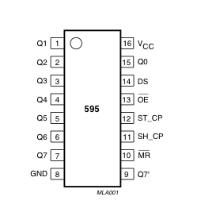
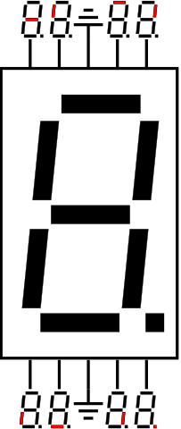

# Digital Thermometer

Displays temperature on two 7-segment displays.

## Parts:
- 1x Arduino UNO
- 1x Shift Register(74HC595)
- 2x 7-Segment Displays
- 2x NPN-Transistors(BC547)
- 1x Temperaturesensor(TMP36)
- 8x 220 ohm-Resistors
- 2x 1k ohm-Resistors

### Shift Register(74HC595) Pin Layout

PINS  1-7, 15  | Q0 " Q7  | Output Pins
---------------|----------|--------------
PIN 8          | GND      | Ground, Vss
PIN 9          | Q7"      | Serial Out
PIN 10         | MR       | Master Reclear, active low
PIN 11         | SH_CP    | Shift register clock pin
PIN 12         | ST_CP    | Storage register clock pin (latch pin)
PIN 13         | OE       | Output enable, active low
PIN 14         | DS       | Serial data input
PIN 16         | Vcc      | Positive supply voltage

Source:
[https://www.arduino.cc/en/Tutorial/ShiftOut](https://www.arduino.cc/en/Tutorial/ShiftOut)

### 7-Segment-Display Pin Layout

#### My Pin-Layout

PINS | LED-Position
-----|-------------
Q0   | top right
Q1   | bottom left
Q2   | bottom
Q3   | bottom right
Q4   | dot
Q5   | middle
Q6   | top left
Q7   | top

Source:
[https://commons.wikimedia.org/wiki/File:7-Segment_Display_Visual_Pinout_Diagram.svg](https://commons.wikimedia.org/wiki/File:7-Segment_Display_Visual_Pinout_Diagram.svg)
