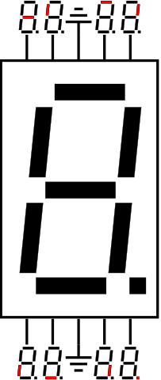

# Digital Thermometer

Displays temperature on two 7-segment displays.

## Parts:

- 1x Arduino UNO
- 2x 7-Segment Displays
- 2x NPN-Transistors(BC547)
- 1x Temperaturesensor(TMP36)
- 8x 220 ohm-Resistors
- 2x 1k ohm-Resistors

### TMP36

Voltage = (Sensor-Value / 1024) * 5

Temperature(°C) = (Voltage - 0.5) * 100

### 7-Segment-Display Pin Layout

#### My Pin-Layout

PINS | LED-Position
-----|-------------
0    | middle
1    | top left
2    | top
3    | top right
4    | bottom left
5    | bottom
6    | bottom right
7    | dot

Source:
[https://commons.wikimedia.org/wiki/File:7-Segment_Display_Visual_Pinout_Diagram.svg](https://commons.wikimedia.org/wiki/File:7-Segment_Display_Visual_Pinout_Diagram.svg)
